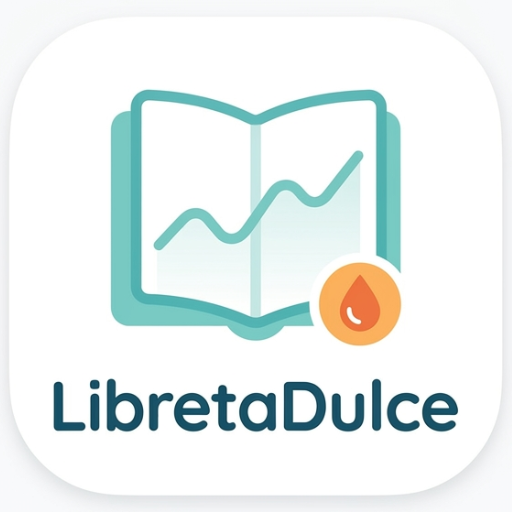
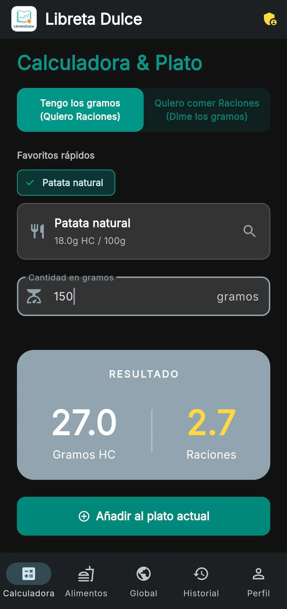
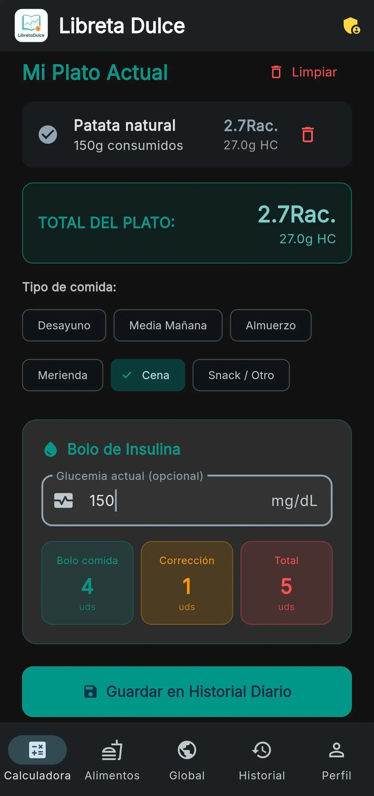
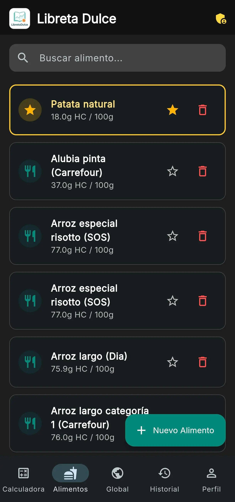
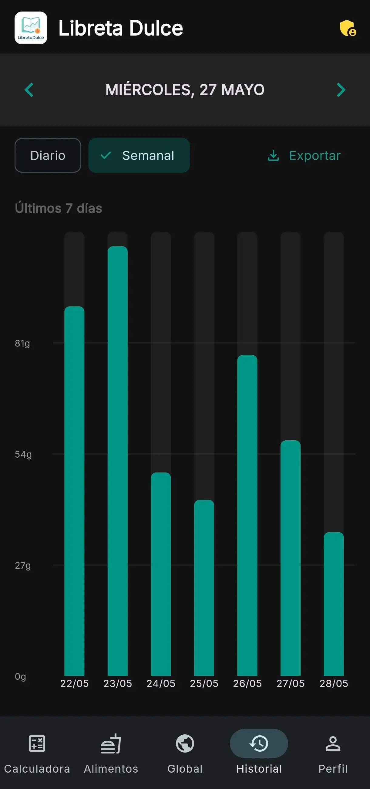

<p align="center">
  
</p>

<h1 align="center">Libreta Dulce</h1>

<p align="center">
  <strong>Tu asistente personal para el control diario de carbohidratos y raciones.</strong><br>
  Hecho con cariño en tiempo libre, por y para diabéticos.
</p>

<p align="center">
  
  
  
  
</p>

---

## Sobre la app

Hola, soy un desarrollador independiente con diabetes. Creé esta aplicación en mi tiempo libre, sin ninguna corporación detrás, con un único objetivo: tener la herramienta más rápida y útil posible para hacer nuestro día a día un poquito más fácil.

Libreta Dulce te ayuda a:

- Mantener tu base de datos personal de alimentos con sus valores nutricionales
- Calcular **raciones de hidratos de carbono** (1 ración = 10g HC) automáticamente
- Calcular el **bolo de insulina** recomendado según tus ratios y glucemia
- Llevar un **historial diario y semanal** de tus comidas con gráficos
- Escanear **códigos de barras** usando OpenFoodFacts
- Buscar en una **base de datos global** compartida por la comunidad
- Exportar tu historial a **CSV** para compartir con tu endocrino

> [!IMPORTANT]
> Esta app **no sustituye el criterio médico**. Los cálculos son orientativos. Consulta siempre con tu endocrino antes de modificar tus pautas de insulina.

---

## Capturas

<div align="center">

| Calculadora | Bolo de insulina | Mis alimentos | Historial |
|:-----------:|:----------------:|:-------------:|:---------:|
|  |  |  |  |

</div>

---

## Funcionalidades

| Módulo | Descripción |
|--------|-------------|
| Calculadora | Añade alimentos a un plato, calcula raciones y bolo de insulina. Soporta cálculo inverso (raciones → gramos) y bolo corrector según glucemia actual |
| Mis Alimentos | Tu base de datos personal. Añade, edita, marca favoritos y busca alimentos con sus macros (HC, kcal, proteínas, grasas) por cada 100g |
| Base Global | Busca alimentos compartidos por la comunidad. Copia a tu lista personal con un toque. Sugiere nuevos productos para revisión |
| Historial | Visualiza tus comidas por día o por semana. Gráfico de barras de consumo de HC. Exporta a CSV |
| Perfil | Configura tus ratios de insulina por comida, factor de corrección, glucemia objetivo, y preferencias de redondeo |
| Escáner | Escanea códigos de barras de productos y obtén sus datos nutricionales al instante vía OpenFoodFacts |

---

## Tecnología

- **Framework**: Flutter 3.11+
- **Backend**: Firebase (Firestore, Auth)
- **Login**: Google Sign-In
- **Gráficos**: fl_chart
- **Escáner**: simple_barcode_scanner + OpenFoodFacts API
- **Exportación**: CSV con share_plus
- **Idiomas**: 8 idiomas (es, en, fr, it, de, pt, pl, cs) vía `flutter_localizations` + ARB

---

## Descargar e instalar (usuarios)

Si solo quieres usar la app sin compilar, descarga el APK desde [GitHub Releases](https://github.com/PokeSer/libretadulce/releases). La versión precompilada incluye Firebase ya configurado, por lo que el login con Google y la base de datos de alimentos compartida funcionan directamente.

Elige el APK según tu dispositivo:

| APK | Para qué dispositivo |
|-----|---------------------|
| `app-arm64-v8a-release.apk` | La gran mayoría de móviles modernos (2017+) |
| `app-armeabi-v7a-release.apk` | Dispositivos antiguos (32-bit) |
| `app-x86_64-release.apk` | Emuladores de Android en PC |
| `app-debug.apk` | Para pruebas, no instalar en uso diario |

> Si no sabes cuál elegir, usa `app-arm64-v8a-release.apk`.

También puedes descargar el `app-release.aab` si prefieres instalar desde Google Play Store (próximamente) o tiendas alternativas.

---

## Empezar a desarrollar

```bash
# Clonar
git clone https://github.com/tuusuario/libretadulce.git
cd libretadulce

# Instalar dependencias
flutter pub get

# Conectar Firebase (necesitas tu propio proyecto)
# 1. Crear proyecto en Firebase Console
# 2. Añadir app Android + iOS + Web
# 3. Colocar google-services.json y GoogleService-Info.plist
# 4. Ejecutar: flutterfire configure
#    (Esto genera lib/firebase_options.dart automáticamente)

# Ejecutar en debug
flutter run
```

---

## CI/CD & Releases

Cada vez que se crea un tag `v*` (ej: `v1.0.0`), GitHub Actions genera automáticamente:

| Artefacto | Descripción |
|-----------|-------------|
| `app-debug.apk` | APK de debug, para pruebas rápidas |
| `app-arm64-v8a-release.apk` | Release para dispositivos modernos (64-bit) |
| `app-armeabi-v7a-release.apk` | Release para dispositivos antiguos (32-bit) |
| `app-x86_64-release.apk` | Release para emuladores x86_64 |
| `app-release.aab` | Android App Bundle para Google Play Store |

También se puede disparar manualmente desde la pestaña **Actions** > **Build & Release** > **Run workflow**.

### Configurar firma de Android

Para que las builds de release de Android funcionen, necesitas configurar 4 secrets en GitHub (**Settings** > **Secrets and variables** > **Actions**):

```bash
# 1. Generar keystore (solo una vez)
keytool -genkey -v -keystore keystore.jks -keyalg RSA \
  -keysize 2048 -validity 10000 -alias upload

# 2. Codificar en base64
# Windows (PowerShell):
[Convert]::ToBase64String([IO.File]::ReadAllBytes("keystore.jks")) | Set-Content keystore.txt
# Linux/macOS:
base64 -i keystore.jks -o keystore.txt

# 3. Copiar el contenido de keystore.txt al secret KEYSTORE_BASE64
```

| Secret | Valor |
|--------|-------|
| `KEYSTORE_BASE64` | Contenido del archivo `keystore.txt` |
| `KEYSTORE_PASSWORD` | Contraseña del keystore |
| `KEY_PASSWORD` | Contraseña de la clave (suele ser la misma) |
| `KEY_ALIAS` | Alias de la clave (ej: `upload`) |

Si no configuras los secrets, la build de release se salta sin fallar — solo se generará el APK de debug.

---

## Añadir un idioma nuevo

1. Crea `lib/l10n/app_xx.arb` con las traducciones (usa `app_en.arb` como plantilla)
2. Añade `'xx_XX'` a la lista `locales` en `lib/main.dart`
3. Ejecuta `flutter gen-l10n`

Cero cambios de código. Solo traducción.

---

## Contribuir

¡Las contribuciones son más que bienvenidas! Así puedes ayudar:

1. **Reporta bugs** abriendo un issue con el formulario correspondiente
2. **Propón mejoras** en la sección de issues
3. **Envía PRs** usando la [plantilla de pull request](.github/PULL_REQUEST_TEMPLATE.md)

### Antes de enviar un PR

```bash
# Asegúrate de que todo está limpio
flutter analyze        # 0 issues
flutter test           # tests pasando
```

### Si añades una funcionalidad nueva

- Explica qué problema resuelve
- Incluye capturas si hay cambios visuales
- Asegúrate de que funciona en tema claro y oscuro

---

## Licencia

GNU General Public License v3.0 — Consulta el archivo [LICENSE](LICENSE) para más detalles.

---

<p align="center">
  <sub>Hecho con ❤️ por <a href="https://github.com/PokeSer">@PokeSer</a></sub>
</p>
